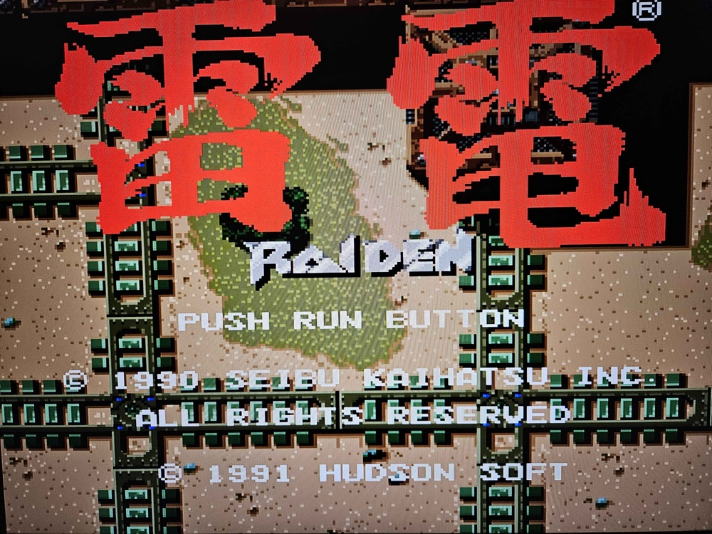
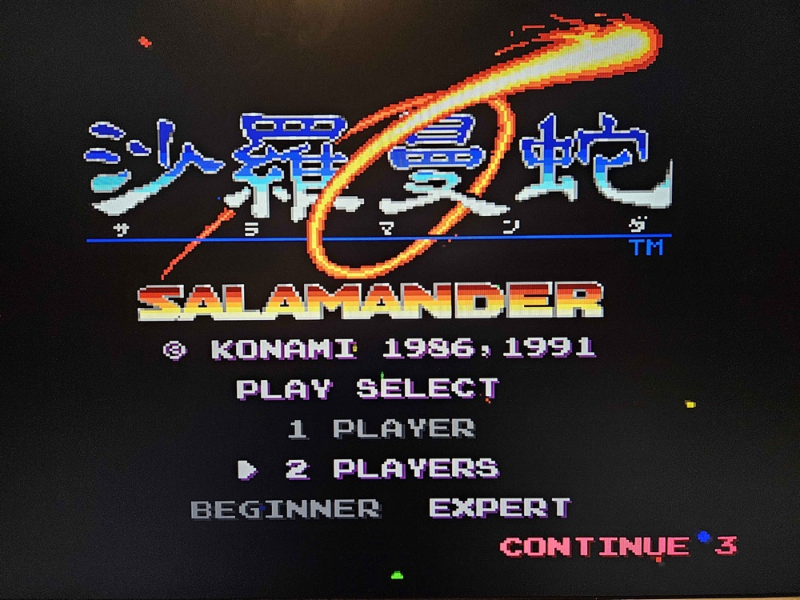
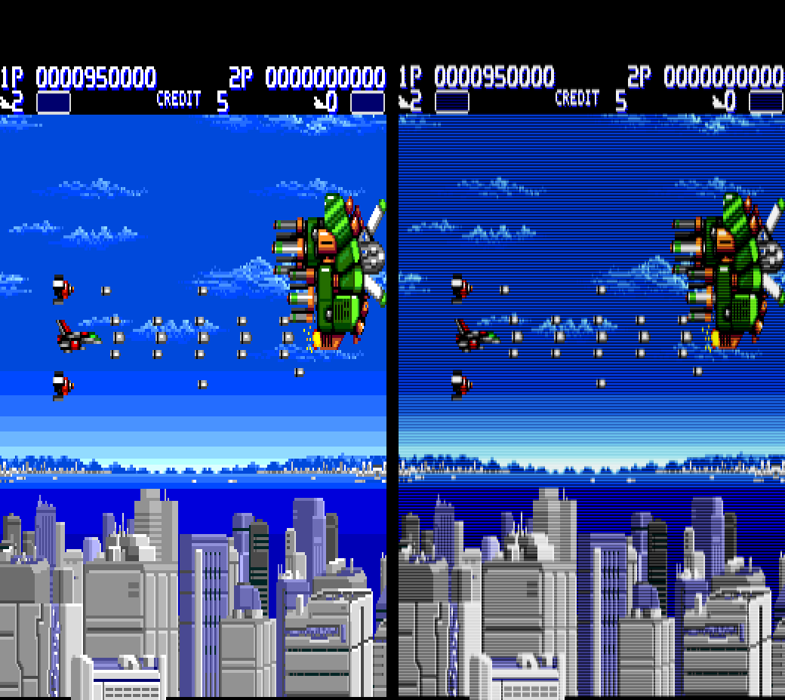

# PCEHeroTN — Beta (Release Candidate 2)

PC Engine / TurboGrafx-16 for the Tang Nano 20K.

<p align="center">
  
  
</p>
<p align="center"><i>Raiden and Salamander on a Tang Nano 20K, photographed from the TV.</i></p>

**New in RC2:** it now runs on **just the Tang Nano 20K**. No Pico, no shield and no
keyboard needed: the board's own BL616 chip runs the menu, the **S1** button opens it and
the gamepad moves through it (some pads need *Setup Gamepad* once, with a keyboard).
Also new: CRT scanlines, turbo, Reset in the menu.
All changes: [CHANGES.md](CHANGES.md).

## What you need

- Tang Nano 20K
- A micro SD card (FAT32)
- One or two USB gamepads (a USB keyboard is optional)
- HDMI screen

Then **one** of these:

- **Just the Tang Nano.** Newer boards only (marked 3923). You need a USB-C OTG adapter
  and a USB hub for the pads. See [bl616](bl616/README.md).
- **A Raspberry Pi Pico (RP2040)**: on a MiSTeryShield20k, or wired to the Tang on a
  breadboard as shown in the
  [FPGA-Companion wiring guide](https://github.com/MiSTle-Dev/FPGA-Companion/tree/main/src/rp2040#example-wiring).

## Files

| File | What it is |
|---|---|
| `PCEHeroTN_RC2.fs` | The core, for the Tang Nano 20K |
| `bl616/` | Firmware for the Tang's own BL616 chip |
| `fpga_companion_msp20k_gamepad_setup.uf2` | Firmware for the Pico |
| `previous/PCEHeroTN_RC1.fs` | The previous release, for reference |

## Install

**1. The firmware (once).**

- **Just the Tang:** see [bl616/README.md](bl616/README.md).
- **Pico:** hold the BOOTSEL button on the Pico and plug it into your computer.
  A drive called `RPI-RP2` appears. Copy `fpga_companion_msp20k_gamepad_setup.uf2` onto it.
  The Pico restarts by itself.

**2. The core.**
Plug the Tang Nano into your computer and run:

```
openFPGALoader -b tangnano20k -f PCEHeroTN_RC2.fs
```

This writes it to the board's flash, so it stays after you unplug.

**3. Games.**
Make a folder called `PCE` on the SD card and put your `.pce` files in it.
Put the card in the Tang Nano's SD slot.

## Play

Power up. You see colour bars until you pick a game.
Press **S1** on the Tang (or **F12** on a keyboard) to open the menu,
go to the `PCE` folder and choose a game.

Two players: plug in a second USB pad.

## Scanlines

<p align="center">
  
</p>
<p align="center"><i>Aero Blasters, plain (left) and CRT-Lite (right). What the core outputs, not a photo.</i></p>

Menu → **Scanlines: CRT-Lite**. It draws each line like the beam of an old CRT TV:
thin lines with dark gaps in dark parts, wide lines in bright parts. So the picture does
not get darker. Games run the same with it on or off.

## Known issues

- A few games do not start yet, for example Street Fighter II.
- HuCards only. No CD-ROM games and no SuperGrafx.
- Switching Scanlines moves the picture 2 lines up or down.
- With no SD card in the slot, choosing the SD card in the menu hangs the menu.
- On the Tang's own chip, the gamepad setup is lost when you power off.
- The Pico firmware has no WiFi or Bluetooth. Use wired USB pads.

## Gamepad does not work?

Use **Setup Gamepad** at the bottom of the menu, and press each button it asks for.
ESC on the keyboard skips one. The PC Engine only needs the first 8.
**Remove Gamepad Setup** puts a pad back to normal.

On the Pico the setup is kept after power-off. On the Tang's own chip it is lost, for now.

## Credits

This builds on the work of Torlus, the MiSTer and MiST teams, Till Harbaum, MiSTle-Dev and others.
See [CREDITS.md](CREDITS.md).
