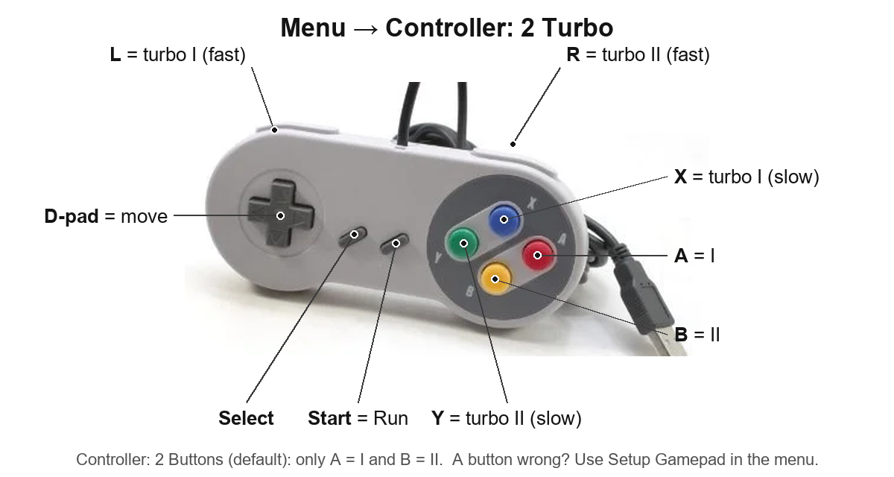

# PCEHeroTN — Beta (Release Candidate 3)

PC Engine / TurboGrafx-16 for the Tang Nano 20K.

<p align="center">
  
  
</p>
<p align="center"><i>Raiden and Salamander on a Tang Nano 20K, photographed from the TV.</i></p>

**RC3** fixes the graphics glitches that paused RC2, and brings everything RC2 had:
CRT scanlines, turbo, the S1 menu button, Reset in the menu. New: it runs faster, and a
Colours option. **RC3 needs a Pico**: running on just the Tang (BL616) is not tested yet.
All changes: [CHANGES.md](CHANGES.md).

## RC1 → RC3

**Added**
- Faster: less slowdown in busy scenes
- Colours (Original / Raw RGB)
- Scanlines (CRT-Lite)
- S1 button opens the menu
- Turbo for buttons I and II
- Reset in the menu, and "No game" to unload a game
- Overscan (Hidden / Visible) and Border (Original / Black) options
- Colour bars when no game is loaded

**Fixed**
- The glitches and crashes that paused RC2
- Bit-reversed US HuCards now boot, for example Cadash (U)
- More reliable reads from the game memory and the USB pads

More detail: [CHANGES.md](CHANGES.md).

## What you need

- Tang Nano 20K
- A Raspberry Pi Pico (RP2040): on a MiSTeryShield20k, or wired to the Tang on a breadboard
  as shown in the [FPGA-Companion wiring guide](https://github.com/MiSTle-Dev/FPGA-Companion/tree/main/src/rp2040#example-wiring)
- A micro SD card (FAT32)
- One or two USB gamepads (a USB keyboard is optional)
- HDMI screen

## Files

| File | What it is |
|---|---|
| `PCEHeroTN_RC3.fs` | The core, for the Tang Nano 20K |
| `fpga_companion_msp20k_gamepad_setup.uf2` | Firmware for the Pico |
| `previous/PCEHeroTN_RC1.fs` | The previous release, for reference |
| `PCEHeroTN_RC3_source.zip` | The source code of RC3 |

The source zip builds `PCEHeroTN_RC3.fs` exactly: unzip it and run
`gw_sh build_nano.tcl` in that folder (Gowin EDA). `LICENCES.md` inside says
which parts carry which licence.

## Install

**1. The Pico firmware (once).**
Hold the BOOTSEL button on the Pico and plug it into your computer.
A drive called `RPI-RP2` appears. Copy `fpga_companion_msp20k_gamepad_setup.uf2` onto it.
The Pico restarts by itself.

**2. The core.**
Plug the Tang Nano into your computer and run:

```
openFPGALoader -b tangnano20k -f PCEHeroTN_RC3.fs
```

This writes it to the board's flash, so it stays after you unplug.

**3. Games.**
Make a folder called `PCE` on the SD card and put your `.pce` files in it.
Put the card in the Tang Nano's SD slot.

## Play

Power up. You see colour bars until you pick a game.
Press **S1** on the Tang (or **F12** on a keyboard) to open the menu,
go to the `PCE` folder and choose a game.

Two players: plug in a second USB pad.

## Buttons on the Tang

- **S1**: opens the menu (same as F12)
- **S2**: Run (start), for player 1

## DB9 joystick

On the MiSTeryShield20k you can plug a classic DB9 joystick (Atari / Amiga style) into
its DB9 port. It works as player 1, together with a USB pad.

- Stick: up, down, left, right
- **Fire 1**: button I
- **Fire 2**: button II

These joysticks have no Run (start) button. Press **S2** on the Tang to start the game.

Please tell us if both fire buttons work for you.

## Scanlines

<p align="center">
  
</p>
<p align="center"><i>Aero Blasters, plain (left) and CRT-Lite (right). What the core outputs, not a photo.</i></p>

Menu → **Scanlines: CRT-Lite**. It draws each line like the beam of an old CRT TV:
thin lines with dark gaps in dark parts, wide lines in bright parts. So the picture does
not get darker. Games run the same with it on or off.

## Colours

Menu → **Colours**:

- **Original** (default): the MiSTer colour table, a bit softer.
- **Raw RGB**: a bit brighter, the RC1 look.

With Scanlines on CRT-Lite, Colours has no effect: the picture always uses Raw RGB.

## Turbo

<p align="center">
  
</p>

Menu → **Controller: 2 Turbo**. Then:

- **X**: turbo I (slow)
- **Y**: turbo II (slow)
- **L**: turbo I (fast)
- **R**: turbo II (fast)
- Your normal **I** and **II** buttons: no turbo

Works on both pads. If turbo does nothing, use **Setup Gamepad** and set the buttons
it calls Button III, Button IV, L and R.

## Known issues

- **Needs a Pico.** Running on just the Tang Nano (its own BL616 chip) is not tested
  with RC3.
- A few games do not start yet, for example Street Fighter II.
- HuCards only. No CD-ROM games and no SuperGrafx.
- Switching Scanlines moves the picture 2 lines up or down.
- With no SD card in the slot, choosing the SD card in the menu hangs the menu.

## Gamepad does not work?

The Pico firmware in this repo is **our own custom build** with an extra
**Setup Gamepad** menu. This breaks the idea of one neutral firmware for all cores (it
adds PC Engine button names to every core's menu), so it is **meant for beta testing only**.

Use **Setup Gamepad** at the bottom of the menu, and press each button it asks for.
ESC on the keyboard skips one. The PC Engine only needs the first 8.
**Remove Gamepad Setup** puts a pad back to normal. The setup is kept after power-off.

## Credits

This builds on the work of Torlus, the MiSTer and MiST teams, Alastair M. Robinson, Till Harbaum, MiSTle-Dev and others.
See [CREDITS.md](CREDITS.md).
